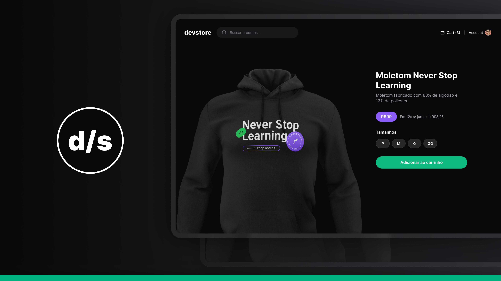
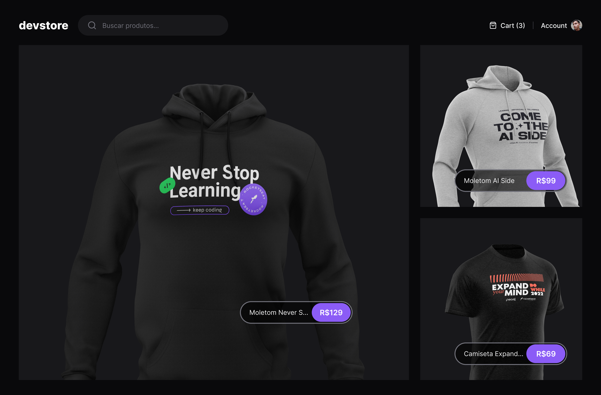
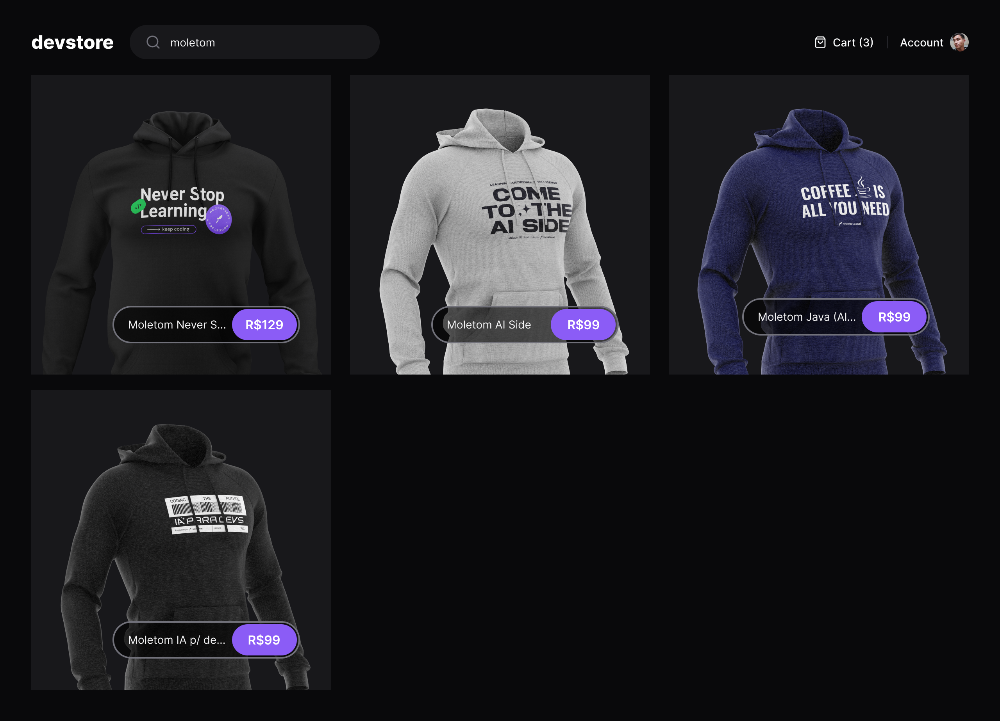
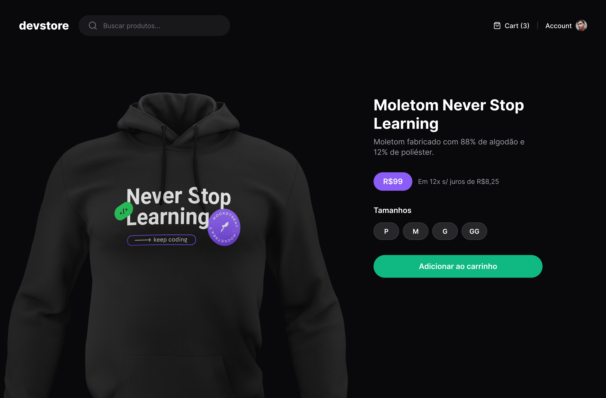

# Devstore
Explorando as funcionalidades do NextJS e testes com Cypress:

- Funcionamento e beneficios do Next
- Estutura de rotas e layouts do NextJS App Router
- Loading com Skeleton Screen
- Funcionabilidade de cache e memorization do Next
- Testes E2E com Cypress
- Workflow de CI com GitHub Actions e Cypress

Tecnologias usadas: NextJS, Cypress, ReactJS, TailwindCSS e Typescript

DEPLOY: [CLIQUE PARA VER O PROJETO](https://devstore-indol.vercel.app/)



## Manual de uso
### Inicialiando o site - [http://localhost:3000/](http://localhost:3000/)
```sh
npm install
```
```sh
npm run dev
```

### Rodar testes
```sh
npm run test
```

## Home


## Pesquisa


## Skeleton da Pesquisa


## Produto

